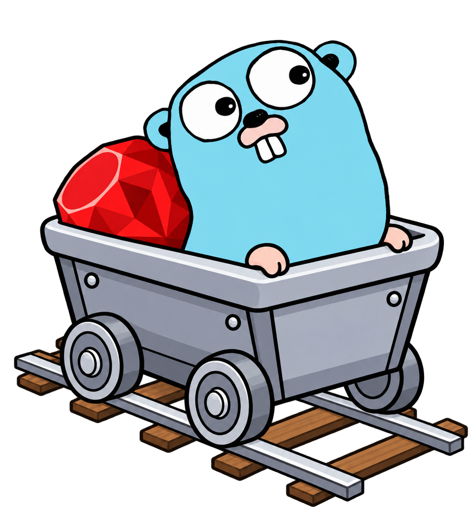
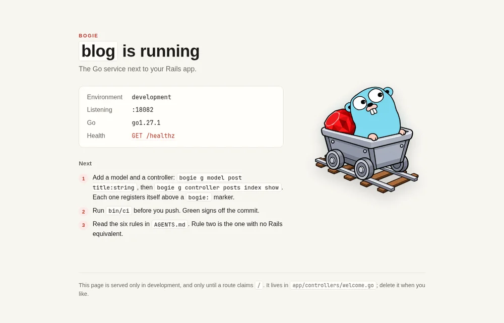

# Bogie

**The Go service next to your Rails app.**

Every Rails shop eventually needs one service that Rails is the wrong tool
for: a webhook receiver that must answer in under a second while a platform
retries at it, a socket gateway holding thousands of idle connections, a
worker draining a queue against a rate-limited API. The web app stays in
Rails. That one thing goes to Go, and the first attempt usually goes badly,
not because of Go but because everything Rails decided for you is suddenly
yours to decide.

Bogie is a CLI that scaffolds that service out of tools the Go ecosystem
already ships (Gin, sqlc, goose, River, Kamal) and builds only the parts that
have no equivalent: a `rails new`-style generator, and generators that also
*wire* new code in rather than leaving you to register it by hand.

    go install github.com/bogie-go/bogie@latest
    bogie new blog
    cd blog && bogie server

A **bogie** is the wheeled frame under a rail car that carries it along the
track. The car body, your application code, is yours. Bogie never ships a
runtime dependency into it: the generated app does not import bogie, and if
you delete the tool tomorrow the app does not notice.

## What it is, and is not

- **Glue, then gaps.** For every Rails concept, the ecosystem tool, wired
  once. Only what has no equivalent gets built.
- **Not a framework.** No `bogie.Application`, no base classes, no DSL.
- **Not full-stack.** API-only, Postgres-only, one choice per concern. If you
  want a Rails-like Go framework with views, see
  [Andurel](https://github.com/mbvlabs/andurel).
- **Written for agents as much as people.** The generated app ships an
  `AGENTS.md` with the rules, the commands, and a recipe per task. An agent
  that runs `bogie g controller` gets the registration right every time.
- **Extracted from a service in production**, not designed on a whiteboard.
- **CI runs on your machine.** `bin/ci` is the whole pipeline, as in Rails
  8.1, and a green run signs off the commit with `gh signoff`. The generated
  app ships one too. No hosted runner.

## Status

**Pre-release.** `bogie new`, the generators, `destroy`, `doctor` and the
Rails-spelled `db:*` and `credentials:*` tasks work; see
[`docs/STATUS.md`](docs/STATUS.md) for exactly what, how to set up a machine,
and what comes next. [`docs/DESIGN.md`](docs/DESIGN.md) has the full design,
the reasoning behind each choice, what the reference service got wrong, and
the questions still open. [`docs/FROM_RAILS.md`](docs/FROM_RAILS.md) is the
dictionary: what each Rails thing is called here, where it lives, and what
has no equivalent. Until the first tagged release, install from a
clone: `go install .`

No telemetry, now or later.

## License

MIT — see [`LICENSE`](LICENSE).
